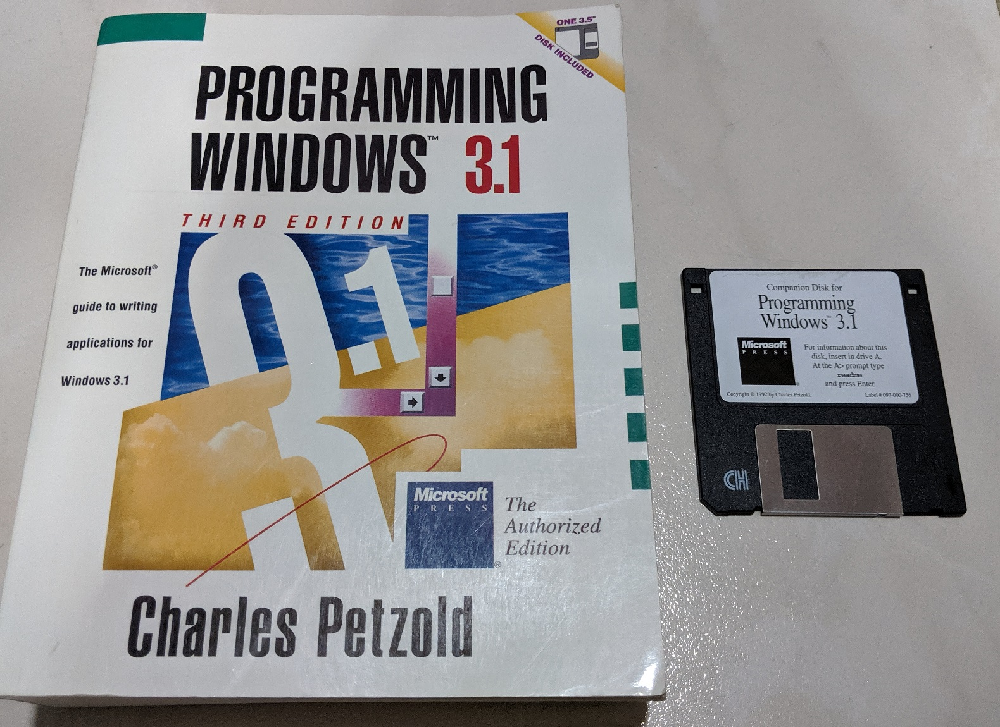

# programming-win31
The book PDF and sample codes provided in the floppy disk of Charles Petzold's book Programming Windows 3.1.

Individual files are in the [disk-files](disk-files) directory. Disk image of the original disk is [program-win31-disk-image](program-win31-disk-image.img)

Book PDF was originally obtained from this [archive.org page](https://archive.org/details/programming-windows-31-3rd-ed/).

Copyright for this still belongs Charles Petzold. I just felt given the age of Windows 3.1, if you have to develop an app for this, this hard-to-find content will definitely be useful.

